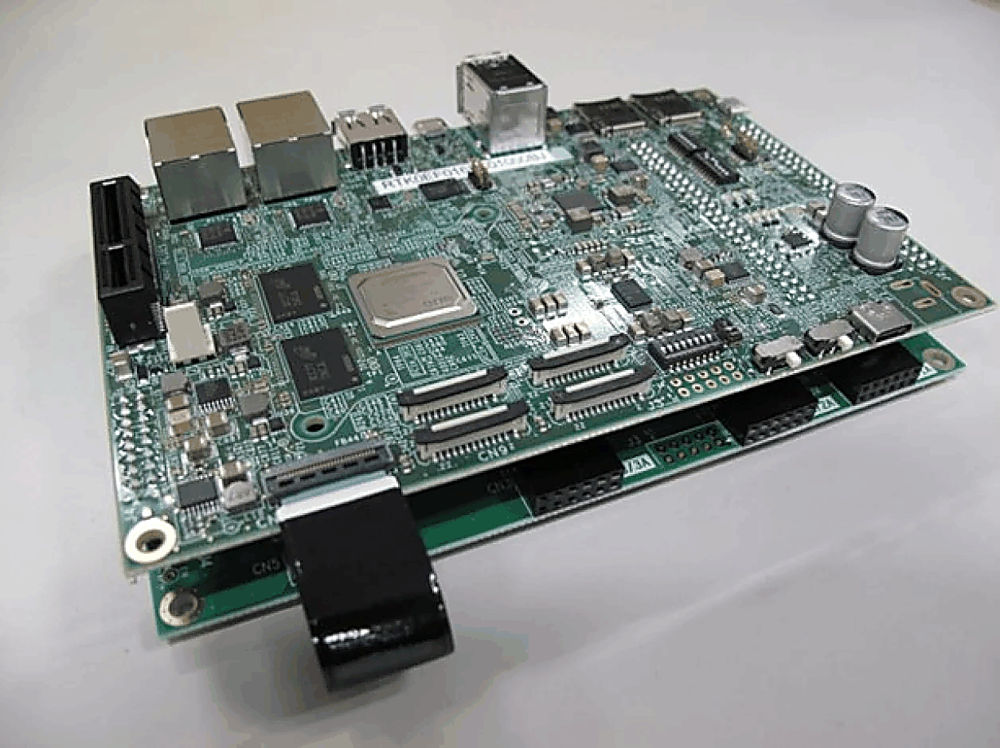
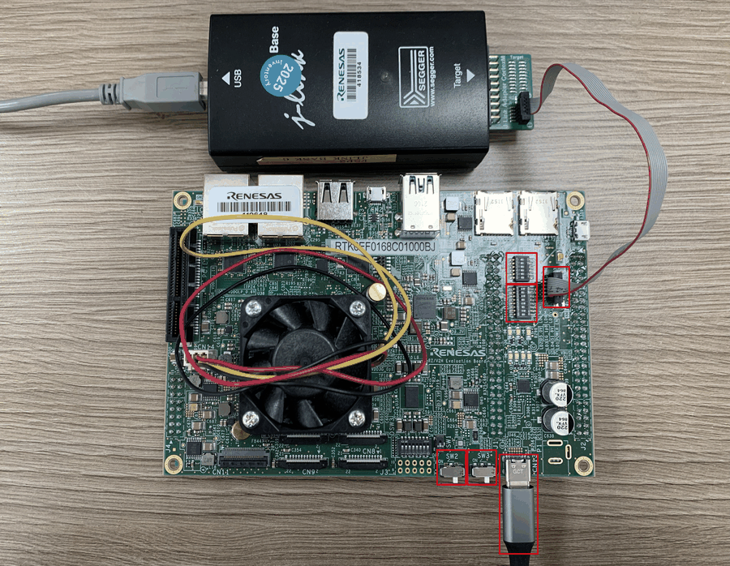

=========
RZV2H-EVK
=========

.. tags:: arch:arm, arch:armv7-r, arch:cortex-r8, chip:rzv2h, vendor:renesas

The RZV2H-EVK is an evaluation board for the Renesas RZ/V2H (R9A09G057)
MPU. NuttX is ported to run on one of the two Cortex-R8 real-time cores
(``CR8_0``).

Board Overview
===============

See the `RZ/V2H product page
<https://www.renesas.com/en/design-resources/boards-kits/rz-v2h-evk#overview>`_
for information about the RZ/V2H MPU.

Board Set-up
============

The following steps set up the board to debug/run NuttX over SWD with a
J-Link debugger:

1. Configure the SWD interface to use the J-Link debugger via the DIP
   switches (highlighted in red in the picture above):

   =====  ===  =====  ===
   DSW 1  Set  DSW 2  Set
   =====  ===  =====  ===
   1-1    ON   2-1    OFF
   1-2    OFF  2-2    OFF
   1-3    ON   2-3    OFF
   1-4    OFF  2-4    OFF
   1-5    ON   2-5    OFF
   1-6    OFF  2-6    OFF
   1-7    ON   2-7    OFF
   1-8    OFF  2-8    OFF
   =====  ===  =====  ===

2. Connect CN1 to the J-Link debugger.

3. Make sure SW2 and SW3 are OFF before connecting CN13 to the power
   supply.

4. After CN13 is connected to the power supply, turn SW3 ON first, then
   turn SW2 ON.

To power off the board, reverse the order: disconnect the J-Link debugger
first, then turn SW2 OFF, then SW3 OFF, and only then remove power.

Getting the Renesas HAL
=======================

Clock bring-up (see below) is implemented on top of Renesas' vendored FSP
BSP code, which ships in a separate ``hal_renesas`` repository and is
**not** part of the ``nuttx`` git tree. It must be cloned as a sibling of
the ``nuttx`` and ``apps`` directories before configuring/building this
board:

.. code-block:: bash

   cd nuttxspace   # parent directory of nuttx/ and apps/
   git clone https://github.com/renesas/hal_renesas.git external/hal_renesas

``make context`` (run automatically as part of a normal build) then copies
the pieces it needs from ``external/hal_renesas`` into
``arch/arm/src/rzv2h/hal_renesas`` via the ``hal_cp`` target defined in
``arch/arm/src/rzv2h/Make.defs``. Without this step the build fails with
missing ``bsp_api.h``/FSP header errors.

Buttons and LEDs
================

Buttons
-------

No board buttons are supported by the NuttX port at this time.

LEDs
----

``board_autoled_*()`` / ``board_userled_*()`` hooks exist in
``boards/arm/rzv2h/rzv2h-evk/src/rzv2h_auto_leds.c``, but they are no-ops:
no GPIO pin mapping has been implemented yet, so enabling
``CONFIG_ARCH_LEDS``/``CONFIG_USERLED`` does not drive any physical LED.

Serial Consoles
===============

The R9A09G057 has multiple SCI (serial communication interface) channels.
``CONFIG_SCI1_*`` Kconfig options are present to select SCI1 as the NSH
console, but there is currently no backing driver: ``rzv2h_serial.c`` and
``rzv2h_lowputc.c`` are empty stubs, so no console output is produced by any
of the current configurations. Bring-up must be done through a debugger
(see Bring-up below).

Bring-up
========

This section describes what has been brought up so far for the CR8_0 core.
Only the items below are implemented; anything else selectable from Kconfig
(serial, LEDs, ...) is a placeholder with no backing driver yet.

Clock control
-------------

``rzv2h_clockconfig()`` (``arch/arm/src/rzv2h/rzv2h_clockconfig.c``) calls
into ``bsp_clock_init()`` from the vendored Renesas FSP BSP
(``arch/arm/src/rzv2h/hal_renesas/...``), which programs the PLL and clock
tree. The system tick timer (see Timer below) derives its input clock from
the resulting ``BSP_CFG_CLOCK_I6CLK_HZ`` value, so this must run before the
timer is configured.

MPU enablement
--------------

``arch/arm/src/rzv2h/rzv2h_mpu_region.c`` defines a static PMSAv7 region
table (``g_mpu_region_table[]``) for CR8 core 0:

- Region 0 - ITCM (0x00000000, 128 KB), read-only, holds the exception
  vector table copied there by ``arm_boot()``.
- Region 1 - DTCM (0x00020000, 128 KB), read/write, execute-never.
- Region 2 - RCPU-SRAM (cacheable), read/write, execute-never default for
  the whole image range.
- Last region - the read-only code window (``__mpu_code_start`` ..
  ``__mpu_code_end``, provided by the linker script), read-only and
  executable, layered on top of region 2 so code remains executable while
  data stays non-executable.

Because PMSAv7 lets the highest-numbered matching region win, the
executable code window must be the last entry in the table, and its size
must be padded to a power of two by the linker script to satisfy PMSAv7's
size/alignment rule.

Interrupt initialization
------------------------

``up_irqinitialize()`` (``arch/arm/src/rzv2h/rzv2h_irq.c``) brings up the
Generic Interrupt Controller (GIC): ``arm_gic0_initialize()`` runs once, on
CPU0 only, followed by ``arm_gic_initialize()`` on every CPU. Interrupts are
then unmasked with ``up_irq_enable()``.

Timer
-----

``arch/arm/src/rzv2h/rzv2h_timerisr.c`` uses the Arm MPCore Private Timer
as the system tick source. Its clock is ``BSP_CFG_CLOCK_I6CLK_HZ / 2``, and
the reload value is derived from ``CLK_TCK`` so the timer fires every system
tick. The Private Timer interrupt (BSP IRQn -3) maps to GIC INTID 29.

Linker script
-------------

``boards/arm/rzv2h/rzv2h-evk/scripts/rzv2h-evk_cr8_0.ld`` defines the memory
map for CR8_0:

- ``ITCM``  0x00000000, 128 KB
- ``DTCM``  0x00020000, 128 KB
- ``RAM``   0x08180000, 512 KB (RCPU-SRAM; holds .vectors, .text, .data,
  .bss, heap and stack)

The exception vector table is linked into RAM (an LMA of 0 could not be
written by the debugger before ITCM is mapped) and copied into ITCM by
``arm_boot()`` at runtime. The read-only code region
(``__mpu_code_start``..``__mpu_code_end``) is padded up to a power of two so
the MPU code window above can be programmed as an exact-fit region with no
sub-region mask.

Loading Code
============

There is no working console or bootloader path yet. Load the ELF image
onto CR8_0 using a J-Link (or similar SWD/JTAG probe) attached to the
board's debug connector, then run from the debugger.

Configurations
==============

nsh
---

Minimal NuttShell configuration exercising clock, MPU and interrupt/timer
bring-up on CR8_0. There is no working console driver yet, so shell I/O is
not available; this configuration is intended for bring-up validation with
a debugger.

nsh-leds
--------

Same bring-up as ``nsh``. The LED-related Kconfig options are currently
placeholders only; ``board_userled_*()`` in
``boards/arm/rzv2h/rzv2h-evk/src/rzv2h_auto_leds.c`` are no-ops.
