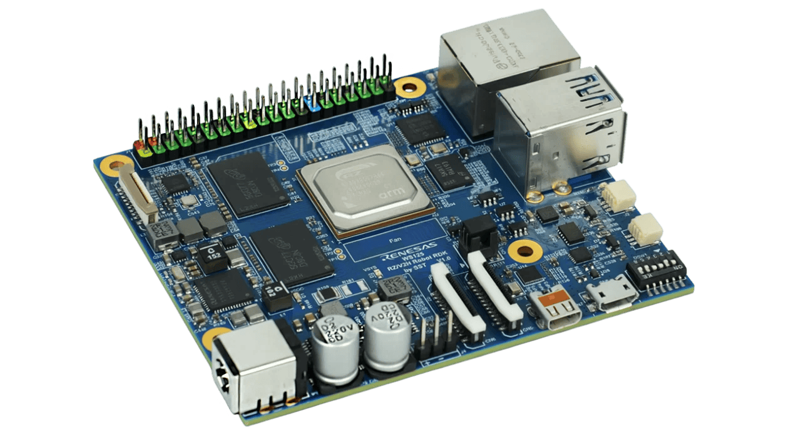
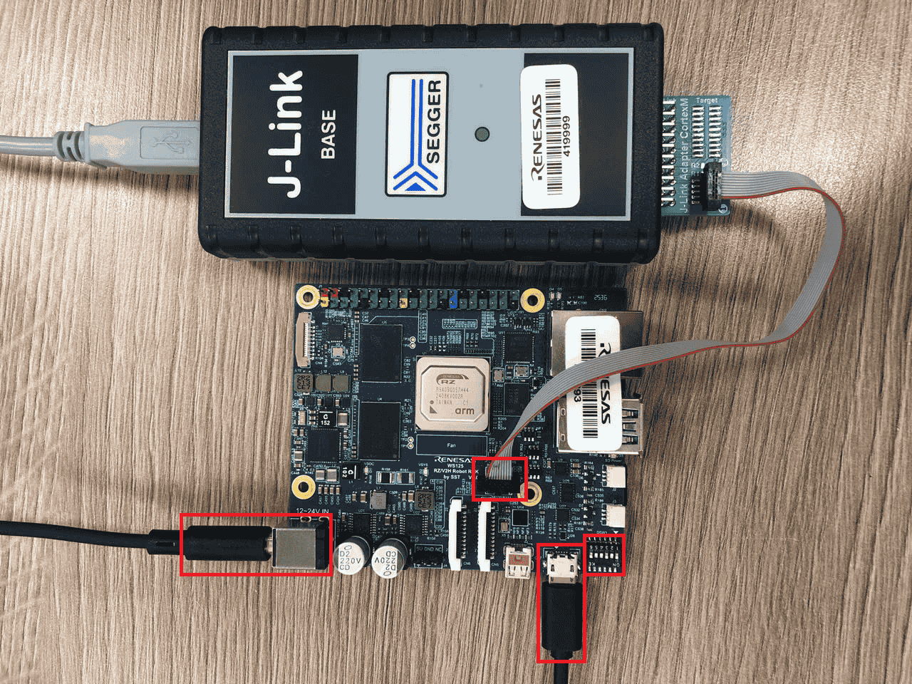

=========
RZV2H-RDK
=========

.. tags:: arch:arm, arch:armv7-r, arch:cortex-r8, chip:rzv2h, vendor:renesas

The RZV2H-RDK is a development board for the Renesas RZ/V2H (R9A09G057)
MPU. NuttX is ported to run on one of the two Cortex-R8 real-time cores
(``CR8_0``).

Board Overview
==============

See the `RZ/V2H product page
<https://www.renesas.com/en/design-resources/boards-kits/ws125-v2hrdkrefz>`_
for information about the RZ/V2H MPU.

Board Set-up
============

The following steps set up the board to debug/run NuttX over SWD with a
J-Link debugger:

1. Configure the SWD interface to use the J-Link debugger via the DIP
   switches (highlighted in red in the picture above):

   ====  ===
   DSW1  Set
   ====  ===
   1-1   ON
   1-2   OFF
   1-3   ON
   1-4   OFF
   1-5   OFF
   1-6   ON
   ====  ===

2. Connect the J-Link debugger to the board's CN1 debug connector.

3. Plug the CN8 serial port (to check the correct IPL).

4. Connect power to the board to P1 connector. The RDK board is powered by external 12 to 24V DC.
It is recommended to use the 12V/2A power adapter included in the box.

To power off the board, disconnect the J-Link debugger first, then remove
power.

Getting the Renesas HAL
=======================

Clock bring-up (see below) is implemented on top of Renesas' vendored FSP
BSP code, which ships in a separate ``hal_renesas`` repository and is
**not** part of the ``nuttx`` git tree. It must be cloned as a sibling of
the ``nuttx`` and ``apps`` directories before configuring/building this
board:

.. code-block:: bash

   cd nuttxspace   # parent directory of nuttx/ and apps/
   git clone https://github.com/renesas/hal_renesas.git external/hal_renesas

``make context`` (run automatically as part of a normal build) then copies
the pieces it needs from ``external/hal_renesas`` into
``arch/arm/src/rzv2h/hal_renesas`` via the ``hal_cp`` target defined in
``arch/arm/src/rzv2h/Make.defs``. Without this step the build fails with
missing ``bsp_api.h``/FSP header errors.

Buttons and LEDs
================

Buttons
-------

The RZ/V2H-RDK has one active-high button on ``P10_0`` exposed through the
generic NuttX GPIO interface as ``/dev/gpio0``.

Hardware connection
~~~~~~~~~~~~~~~~~~~

Connect a normally-open momentary switch between ``P10_0`` and the board's
3.3-V logic supply, with a common ground between the board and the external
circuit.  The board configures ``P10_0`` as an input with its internal
pull-down enabled:

* button released: the pull-down drives the input low; ``/dev/gpio0`` reads
  ``0``;
* button pressed: the switch drives the input high; ``/dev/gpio0`` reads
  ``1``.

The pin definition is ``BOARD_P10_0_BUTTON`` in
``boards/arm/rzv2h/rzv2h-rdk/include/board.h``.  It selects
``BSP_IO_PORT_10_PIN_00`` with input, input-buffer, and pull-down settings.

.. warning::

   ``P10_0`` is a multiplexed pin.  Confirm the RDK schematic and make sure
   that no enabled peripheral claims this pin before connecting the button.

Configuration and registration
~~~~~~~~~~~~~~~~~~~~~~~~~~~~~~

Use a configuration that enables the generic GPIO test path, for example
``rzv2h-rdk:nsh-leds``.  The required options are::

   CONFIG_DEV_GPIO=y
   CONFIG_RZV2H_GPIO=y
   CONFIG_EXAMPLES_GPIO=y
   CONFIG_BOARD_LATE_INITIALIZE=y

During ``board_late_initialize()``, ``rzv2h_bringup()`` calls
``rzv2h_gpio_initialize()``.  This registers the button input first as
``/dev/gpio0`` and configures the input through the Renesas FSP IOPORT
driver.

NSH usage example
~~~~~~~~~~~~~~~~~

After booting NuttX, first verify that the device was registered::

   nsh> ls /dev
   nsh> gpio /dev/gpio0
   Driver: /dev/gpio0
     Input pin:     Value=0

Press and hold the button, then run the read command again::

   nsh> gpio /dev/gpio0
   Driver: /dev/gpio0
     Input pin:     Value=1

Release the button and repeat the command; the value must return to ``0``.

Current limitations
~~~~~~~~~~~~~~~~~~~

The current GPIO implementation supports synchronous read and write only.
GPIO interrupt attachment and enablement are placeholders, so ``gpio -w``
cannot report button transitions.  Runtime pin-type changes are also not
implemented, so do not use ``gpio -t``.  The board does not debounce the
external switch; use a polling application with software debounce if
continuous monitoring is required.

LEDs
----

Two active-low GPIO outputs are available for LED testing.  They are
registered after the button input, giving the following device mapping:

.. list-table::
   :header-rows: 1

   * - Pin
     - GPIO device
     - Function
   * - ``P11_4``
     - ``/dev/gpio1``
     - LED output 1
   * - ``P11_5``
     - ``/dev/gpio2``
     - LED output 2

Using the NSH GPIO application
~~~~~~~~~~~~~~~~~~~~~~~~~~~~~~

The ``nsh`` configuration enables ``CONFIG_DEV_GPIO`` and
``CONFIG_EXAMPLES_GPIO``.  The ``gpio`` example is reused from the standard
NuttX application repository at ``apps/examples/gpio``; it is not an
RZ/V2H-specific application.  The RZ/V2H board port only configures the pins,
registers ``/dev/gpio0`` through ``/dev/gpio2``, and enables the example in
the board configuration.

For these LED outputs, only ``-o`` and the device path are needed.  The
``-o`` option writes the logical pin level (zero or one), while the device
path selects the LED.  Because the LEDs are active low, write zero to turn an
LED on and one to turn it off.  For example::

   nsh> gpio -o 0 /dev/gpio1
   nsh> gpio -o 1 /dev/gpio1
   nsh> gpio -o 0 /dev/gpio2
   nsh> gpio -o 1 /dev/gpio2

Using the NuttX user-LED application
~~~~~~~~~~~~~~~~~~~~~~~~~~~~~~~~~~~~

The ``nsh-leds`` configuration also enables the standard NuttX user-LED
interface and example with these options::

   # CONFIG_ARCH_LEDS is not set
   CONFIG_USERLED=y
   CONFIG_USERLED_LOWER=y
   CONFIG_EXAMPLES_LEDS=y
   CONFIG_BOARD_LATE_INITIALIZE=y

During late initialization, the board registers ``/dev/userleds``.  The
``board_userled_*()`` callbacks configure ``P11_4`` and ``P11_5``, convert the
logical LED state to the active-low pin level, and support LED mask bits
``0x01`` and ``0x02``.

Run the unmodified NuttX example from ``apps/examples/leds`` to cycle the two
LED outputs::

   nsh> ls /dev
   nsh> leds

The device list should contain ``userleds``, and the example should report a
supported LED mask of ``0x03``.

SPI
===

The RZ/V2H-RDK board logic configures pins and registers the RZ/V2H SPI-B
lower half.  All three channels can be enabled independently.  A channel
selected as master uses the NuttX master interface; a channel selected as
slave uses the separate NuttX slave-controller interface.

Pin Assignments
---------------

The SPI-B channels use the following board-defined pin assignments.  The SSL
column shows the default route selected in
``boards/arm/rzv2h/rzv2h-rdk/include/board.h``.  SSL is configured only in
4-wire mode.

.. list-table::
   :header-rows: 1

   * - Channel
     - RSPCK Pin
     - MOSI Pin
     - MISO Pin
     - Default SSL Pin
   * - SPI-B 0
     - ``P9_2``
     - ``P9_0``
     - ``P9_1``
     - ``SSLA0`` on ``P9_3``
   * - SPI-B 1
     - ``PB_0``
     - ``PB_1``
     - ``PB_2``
     - ``SSLB0`` on ``PA_4``
   * - SPI-B 2
     - ``PB_5``
     - ``PB_4``
     - ``PB_3``
     - ``SSLC0`` on ``PA_7``

Configuration
-------------

Start from the dedicated configuration when validating SPI::

   tools/configure.sh rzv2h-rdk:nsh-spi
   make

Serial Consoles
===============

The default ``nsh`` configuration uses SCI channel 0 as the serial console
at 115200 baud, 8 data bits, no parity, and one stop bit. The board pin
definitions route SCI0 as follows:

======  ========  =======================  ==========
Signal  Pin       Board definition         J1 header
======  ========  =======================  ==========
TXD0    ``P5_0``  ``BOARD_SCI0_TXD_GPIO``  J1 pin 36
RXD0    ``P5_1``  ``BOARD_SCI0_RXD_GPIO``  J1 pin 22
======  ========  =======================  ==========

Connect a 3.3 V TTL UART adapter to the J1 header pins listed above.
Cross the data lines so that J1 TXD0 connects to the adapter RX and J1
RXD0 connects to the adapter TX. Hardware flow control is not enabled.
Use a 3.3 V TTL UART adapter, not an RS-232 adapter.

The relevant default options are::

   CONFIG_RZV2H_UART_SCI=y
   CONFIG_RZV2H_SCI_B_UART0=y
   CONFIG_SCI0_SERIAL_CONSOLE=y
   CONFIG_SCI0_BAUD=115200
   CONFIG_SCI0_BITS=8
   CONFIG_SCI0_PARITY=0
   CONFIG_SCI0_2STOP=0

After boot, SCI0 is available as both ``/dev/console`` and ``/dev/ttyS0``.
The terminal should display the NuttX banner followed by the ``nsh>`` prompt.
Verify the registration with::

   nsh> ls /dev
   /dev:
    console
    null
    ttyS0
    zero

Additional enabled SCI channels are registered as later ``/dev/ttyS*``
devices in ascending hardware-channel order. Their TX and RX pin choices are
board-specific and are defined by ``BOARD_SCIn_TXD_GPIO`` and
``BOARD_SCIn_RXD_GPIO`` in ``boards/arm/rzv2h/rzv2h-rdk/include/board.h``.

Real-Time Clock (RTC)
=====================

The RZ/V2H RTC provides a calendar clock, a one-shot alarm and a periodic
wakeup.  It is registered through ``CONFIG_RTC_ARCH`` so a single driver both
exposes ``/dev/rtc0`` and seeds the NuttX system clock at boot.  If the RTC
has never been set, the system clock falls back to the build-time default
date.

Clock source
------------

On the RZ/V2H-RDK the RTC sub-clock is driven from a 32.768 kHz crystal.

Configuration
-------------

Enable the RTC on top of an existing configuration (for example
``rzv2h-rdk:nsh``) with the following options::

   CONFIG_RTC=y
   CONFIG_RTC_DATETIME=y
   CONFIG_RTC_DRIVER=y
   CONFIG_RTC_ARCH=y
   CONFIG_RTC_ALARM=y
   CONFIG_RTC_NALARMS=1
   CONFIG_RTC_PERIODIC=y
   CONFIG_RZV2H_RTC=y
   CONFIG_NSH_DISABLE_DATE=n
   CONFIG_SIG_EVTHREAD=y
   CONFIG_SCHED_LPWORK=y
   CONFIG_EXAMPLES_ALARM=y
   CONFIG_BOARD_LATE_INITIALIZE=y

With these options the board registers ``/dev/rtc0`` during board
initialization.

NSH usage example
-----------------

Read and set the calendar with the NSH ``date`` builtin
(``CONFIG_NSH_DISABLE_DATE=n``).  If the RTC has never been set, the boot
log reports the fallback and ``date`` shows the build-time default:

.. code-block:: console

   rzv2h_rtc: RTC not set; using build-time default date
   NuttShell (NSH) NuttX-13.0.0
   nsh> date -s "Jul 29 15:30:00 2026"
   nsh> date
   Wed, Jul 29 15:30:01 2026

PWM
===

The RZV2H-RDK exposes GPT-based PWM output on channels 0 through 15.

Pin Assignments
---------------

Each GPT channel is routed to the following board pin.

.. list-table::
   :header-rows: 1

   * - Channel
     - Pin
   * - GPT0
     - ``P7_0``
   * - GPT1
     - ``P8_0``
   * - GPT2
     - ``P4_4``
   * - GPT3
     - ``P4_6``
   * - GPT4
     - ``P9_4``
   * - GPT5
     - ``P9_6``
   * - GPT6
     - ``PA_4``
   * - GPT7
     - ``P8_6``
   * - GPT8
     - ``P9_4``
   * - GPT9
     - ``P9_6``
   * - GPT10
     - ``PA_4``
   * - GPT11
     - ``P6_2``
   * - GPT12
     - ``P3_0``
   * - GPT13
     - ``P6_4``
   * - GPT14
     - ``P3_5``
   * - GPT15
     - ``P6_6``

These definitions are in ``boards/arm/rzv2h/rzv2h-rdk/include/board.h``.

The ``pwm`` board configuration (``rzv2h-rdk:pwm``) enables GPT6
(PWM output on ``PA_4``) and the ``pwm`` application for interactive testing.

Configurations
==============

nsh
---

NuttShell configuration exercising clock, MPU, interrupt/timer, GPIO, and
SCI-B UART bring-up on CR8_0. SCI0 provides the default 115200-8N1 NSH
console through J1 pin 22 (RXD0) and J1 pin 36 (TXD0) and is registered
as ``/dev/console`` and ``/dev/ttyS0``.

nsh-leds
--------

This configuration enables ``CONFIG_USERLED``, registers ``/dev/userleds``,
and includes the standard NuttX ``leds`` example.  Run ``leds`` to cycle the
active-low ``P11_4`` and ``P11_5`` LED outputs.  The generic ``/dev/gpio0``,
``/dev/gpio1``, and ``/dev/gpio2`` interfaces are also available for
individual read/write testing.

nsh-spi
-------

NuttShell configuration for SPI-B loopback testing on channel 0 only.
SPI-B channel 0 is configured as a master at 1 MHz, mode 0, 8-bit words.
The ``spislv`` and ``spitool`` applications are included for interactive
loopback verification.  Only channel 0 can be tested on this board.

pwm
---

PWM configuration enabling GPT6 with the ``pwm`` application for
interactive frequency and duty-cycle testing.  The channel is registered
as ``/dev/pwm6`` at boot.

alarm
-----

NSH + RTC alarm example: enables RTC with alarm support and the
``apps/examples/alarm`` application.
