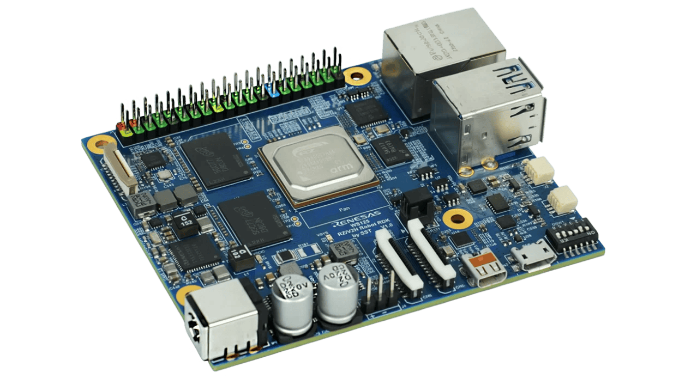
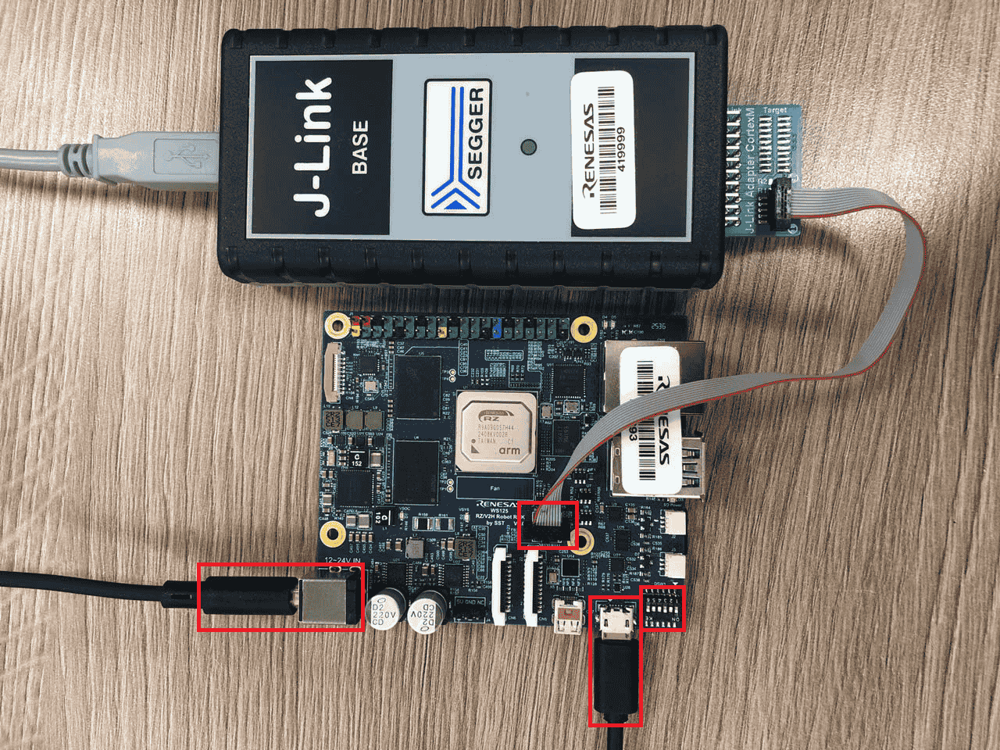

=========
RZV2H-RDK
=========

.. tags:: arch:arm, arch:armv7-r, arch:cortex-r8, chip:rzv2h, vendor:renesas

The RZV2H-RDK is a development board for the Renesas RZ/V2H (R9A09G057)
MPU. NuttX is ported to run on one of the two Cortex-R8 real-time cores
(``CR8_0``).

Board Overview
==============

See the `RZ/V2H product page
<https://www.renesas.com/en/design-resources/boards-kits/ws125-v2hrdkrefz>`_
for information about the RZ/V2H MPU.

Board Set-up
============

The following steps set up the board to debug/run NuttX over SWD with a
J-Link debugger:

1. Configure the SWD interface to use the J-Link debugger via the DIP
   switches (highlighted in red in the picture above):

   ====  ===
   DSW1  Set
   ====  ===
   1-1   ON
   1-2   OFF
   1-3   ON
   1-4   OFF
   1-5   OFF
   1-6   ON
   ====  ===

2. Connect the J-Link debugger to the board's CN1 debug connector.

3. Plug the CN8 serial port (to check the correct IPL).

4. Connect power to the board to P1 connector. The RDK board is powered by external 12 to 24V DC.
It is recommended to use the 12V/2A power adapter included in the box.

To power off the board, disconnect the J-Link debugger first, then remove
power.

Getting the Renesas HAL
=======================

Clock bring-up (see below) is implemented on top of Renesas' vendored FSP
BSP code, which ships in a separate ``hal_renesas`` repository and is
**not** part of the ``nuttx`` git tree. It must be cloned as a sibling of
the ``nuttx`` and ``apps`` directories before configuring/building this
board:

.. code-block:: bash

   cd nuttxspace   # parent directory of nuttx/ and apps/
   git clone https://github.com/renesas/hal_renesas.git external/hal_renesas

``make context`` (run automatically as part of a normal build) then copies
the pieces it needs from ``external/hal_renesas`` into
``arch/arm/src/rzv2h/hal_renesas`` via the ``hal_cp`` target defined in
``arch/arm/src/rzv2h/Make.defs``. Without this step the build fails with
missing ``bsp_api.h``/FSP header errors.

Buttons and LEDs
================

Buttons
-------

The RZ/V2H-RDK has one active-high button on ``P10_0`` exposed through the
generic NuttX GPIO interface as ``/dev/gpio0``.

Hardware connection
~~~~~~~~~~~~~~~~~~~

Connect a normally-open momentary switch between ``P10_0`` and the board's
3.3-V logic supply, with a common ground between the board and the external
circuit.  The board configures ``P10_0`` as an input with its internal
pull-down enabled:

* button released: the pull-down drives the input low; ``/dev/gpio0`` reads
  ``0``;
* button pressed: the switch drives the input high; ``/dev/gpio0`` reads
  ``1``.

The pin definition is ``BOARD_P10_0_BUTTON`` in
``boards/arm/rzv2h/rzv2h-rdk/include/board.h``.  It selects
``BSP_IO_PORT_10_PIN_00`` with input, input-buffer, and pull-down settings.

.. warning::

   ``P10_0`` is a multiplexed pin.  Confirm the RDK schematic and make sure
   that no enabled peripheral claims this pin before connecting the button.

Configuration and registration
~~~~~~~~~~~~~~~~~~~~~~~~~~~~~~

Use a configuration that enables the generic GPIO test path, for example
``rzv2h-rdk:nsh-leds``.  The required options are::

   CONFIG_DEV_GPIO=y
   CONFIG_RZV2H_GPIO=y
   CONFIG_EXAMPLES_GPIO=y
   CONFIG_BOARD_LATE_INITIALIZE=y

During ``board_late_initialize()``, ``rzv2h_bringup()`` calls
``rzv2h_gpio_initialize()``.  This registers the button input first as
``/dev/gpio0`` and configures the input through the Renesas FSP IOPORT
driver.

NSH usage example
~~~~~~~~~~~~~~~~~

After booting NuttX, first verify that the device was registered::

   nsh> ls /dev
   nsh> gpio /dev/gpio0
   Driver: /dev/gpio0
     Input pin:     Value=0

Press and hold the button, then run the read command again::

   nsh> gpio /dev/gpio0
   Driver: /dev/gpio0
     Input pin:     Value=1

Release the button and repeat the command; the value must return to ``0``.

Current limitations
~~~~~~~~~~~~~~~~~~~

The current GPIO implementation supports synchronous read and write only.
GPIO interrupt attachment and enablement are placeholders, so ``gpio -w``
cannot report button transitions.  Runtime pin-type changes are also not
implemented, so do not use ``gpio -t``.  The board does not debounce the
external switch; use a polling application with software debounce if
continuous monitoring is required.

LEDs
----

Two active-low GPIO outputs are available for LED testing.  They are
registered after the button input, giving the following device mapping:

.. list-table::
   :header-rows: 1

   * - Pin
     - GPIO device
     - Function
   * - ``P11_4``
     - ``/dev/gpio1``
     - LED output 1
   * - ``P11_5``
     - ``/dev/gpio2``
     - LED output 2

Using the NSH GPIO application
~~~~~~~~~~~~~~~~~~~~~~~~~~~~~~

The ``nsh`` configuration enables ``CONFIG_DEV_GPIO`` and
``CONFIG_EXAMPLES_GPIO``.  The ``gpio`` example is reused from the standard
NuttX application repository at ``apps/examples/gpio``; it is not an
RZ/V2H-specific application.  The RZ/V2H board port only configures the pins,
registers ``/dev/gpio0`` through ``/dev/gpio2``, and enables the example in
the board configuration.

For these LED outputs, only ``-o`` and the device path are needed.  The
``-o`` option writes the logical pin level (zero or one), while the device
path selects the LED.  Because the LEDs are active low, write zero to turn an
LED on and one to turn it off.  For example::

   nsh> gpio -o 0 /dev/gpio1
   nsh> gpio -o 1 /dev/gpio1
   nsh> gpio -o 0 /dev/gpio2
   nsh> gpio -o 1 /dev/gpio2

Using the NuttX user-LED application
~~~~~~~~~~~~~~~~~~~~~~~~~~~~~~~~~~~~

The ``nsh-leds`` configuration also enables the standard NuttX user-LED
interface and example with these options::

   # CONFIG_ARCH_LEDS is not set
   CONFIG_USERLED=y
   CONFIG_USERLED_LOWER=y
   CONFIG_EXAMPLES_LEDS=y
   CONFIG_BOARD_LATE_INITIALIZE=y

During late initialization, the board registers ``/dev/userleds``.  The
``board_userled_*()`` callbacks configure ``P11_4`` and ``P11_5``, convert the
logical LED state to the active-low pin level, and support LED mask bits
``0x01`` and ``0x02``.

Run the unmodified NuttX example from ``apps/examples/leds`` to cycle the two
LED outputs::

   nsh> ls /dev
   nsh> leds

The device list should contain ``userleds``, and the example should report a
supported LED mask of ``0x03``.

SPI
===

The RZ/V2H-RDK board logic configures pins and registers the RZ/V2H SPI-B
lower half.  All three channels can be enabled independently.  A channel
selected as master uses the NuttX master interface; a channel selected as
slave uses the separate NuttX slave-controller interface.

Pin Assignments
---------------

The SPI-B channels use the following board-defined pin assignments.  The SSL
column shows the default route selected in
``boards/arm/rzv2h/rzv2h-rdk/include/board.h``.  SSL is configured only in
4-wire mode.

.. list-table::
   :header-rows: 1

   * - Channel
     - RSPCK Pin
     - MOSI Pin
     - MISO Pin
     - Default SSL Pin
   * - SPI-B 0
     - ``P9_2``
     - ``P9_0``
     - ``P9_1``
     - ``SSLA0`` on ``P9_3``
   * - SPI-B 1
     - ``PB_0``
     - ``PB_1``
     - ``PB_2``
     - ``SSLB0`` on ``PA_4``
   * - SPI-B 2
     - ``PB_5``
     - ``PB_4``
     - ``PB_3``
     - ``SSLC0`` on ``PA_7``

Configuration
-------------

Start from the dedicated configuration when validating SPI::

   tools/configure.sh rzv2h-rdk:nsh-spi
   make

QSPI Flash
==========

The board port drives the xSPI controller in QSPI mode (see
:doc:`the RZV2H peripheral overview <../../index>`) to talk to a SPI NOR
flash device. There is no flash part wired into the NuttX tree for this
board; select the matching ``CONFIG_MTD_*`` driver for the part actually
fitted on the RDK before enabling ``CONFIG_RZV2H_QSPI``.

``rzv2h_qspi_initialize()``
(``boards/arm/rzv2h/rzv2h-rdk/src/rzv2h_qspi.c``) brings up the bus,
initializes the selected MTD flash driver, and then either:

- mounts the whole chip as a single flat LittleFS volume at ``/mnt/qspi``
  (default), or
- if ``CONFIG_MTD_PARTITION`` is enabled, splits the chip into three MTD
  partitions first (see Partitioning below), and mounts LittleFS on the
  remaining space only.

Read protocol
-------------

The default read protocol is ``1S-4S-4S``. ``1S-1S-1S``, ``1S-2S-2S``,
and ``4S-4S-4S`` also work on this board. They are selected with the
``CONFIG_RZV2H_QSPI_N25QXXX_PROTOCOL_*`` choice (see
:doc:`the RZV2H peripheral overview <../../index>`).

This board ties ``XSPI0_DS`` to GND through a 10K resistor (R47). It
also leaves ``XSPI0_IO4``-``XSPI0_IO7`` unconnected to the flash. As a
result, the DDR protocols cannot work here:

- Selecting ``CONFIG_RZV2H_QSPI_N25QXXX_PROTOCOL_4S4D4D`` stops the build
  with an ``#error``.
- ``8D-8D-8D`` is not supported.

Partitioning
------------

Enabling ``CONFIG_MTD_PARTITION`` (plus ``CONFIG_MTD_CONFIG`` or
``CONFIG_MTD_CONFIG_NVS``) makes ``rzv2h_qspi_partition()`` divide
the flash chip into three independent regions, so that firmware,
parameters, and logging cannot corrupt one another on the same chip:

.. list-table::
   :header-rows: 1

   * - Partition
     - Size (Kconfig)
     - Exposed as
     - Purpose
   * - Firmware image
     - ``CONFIG_RZV2H_QSPI_FW_PART_SIZE`` (KiB, default 4096)
     - ``/dev/mtdfw0`` (raw MTD, no filesystem)
     - Fixed-offset region for a flight-stack (e.g. PX4) firmware image,
       read/written directly by a bootloader/loader
   * - Parameter/configuration
     - ``CONFIG_RZV2H_QSPI_PARAM_PART_SIZE`` (KiB, default 256)
     - ``/dev/config`` (via ``mtdconfig_register()``)
     - Key/value parameter and configuration store, isolated from
       filesystem I/O
   * - Mission data / flight logs
     - remainder of the chip
     - ``/mnt/qspi`` (LittleFS)
     - Ordinary files: mission data, flight logs, and (optionally) the
       redirected syslog file described below

Both partition sizes are rounded down to a multiple of the flash erase
size. If the requested firmware and parameter partitions do not fit
within the chip's erase-block count, ``rzv2h_qspi_initialize()``
fails with an error logged via ``syslog()``.

When ``CONFIG_MTD_PARTITION`` is disabled, none of the above applies and
the chip is used as a single flat LittleFS volume, as before.

Persistent syslog
------------------

``CONFIG_RZV2H_QSPI_SYSLOG_FILE`` redirects kernel ``syslog()`` output to
a file on the mounted QSPI LittleFS volume (default path
``/mnt/qspi/syslog.txt``, set via ``CONFIG_RZV2H_QSPI_SYSLOG_FILE_PATH``)
once it is mounted, so log messages persist across resets. This requires
``CONFIG_FS_LITTLEFS`` and ``CONFIG_SYSLOG_FILE``. When
``CONFIG_MTD_PARTITION`` is enabled, this file lives in the mission-data
/ flight-log partition described above, not in the firmware or parameter
partitions.

Serial Consoles
===============

The default ``nsh`` configuration uses SCI channel 0 as the serial console
at 115200 baud, 8 data bits, no parity, and one stop bit. The board pin
definitions route SCI0 as follows:

======  ========  =======================  ==========
Signal  Pin       Board definition         J1 header
======  ========  =======================  ==========
TXD0    ``P5_0``  ``BOARD_SCI0_TXD_GPIO``  J1 pin 22
RXD0    ``P5_1``  ``BOARD_SCI0_RXD_GPIO``  J1 pin 36
======  ========  =======================  ==========

Connect a 3.3 V TTL UART adapter to the J1 header pins listed above.
Cross the data lines so that J1 TXD0 connects to the adapter RX and J1
RXD0 connects to the adapter TX. Hardware flow control is not enabled.
Use a 3.3 V TTL UART adapter, not an RS-232 adapter.

The relevant default options are::

   CONFIG_RZV2H_UART_SCI=y
   CONFIG_RZV2H_SCI_UART0=y
   CONFIG_SCI0_SERIAL_CONSOLE=y
   CONFIG_SCI0_BAUD=115200
   CONFIG_SCI0_BITS=8
   CONFIG_SCI0_PARITY=0
   CONFIG_SCI0_2STOP=0

After boot, SCI0 is available as both ``/dev/console`` and ``/dev/ttyS0``.
The terminal should display the NuttX banner followed by the ``nsh>`` prompt.
Verify the registration with::

   nsh> ls /dev
   /dev:
    console
    null
    ttyS0
    zero

Additional enabled SCI channels are registered as later ``/dev/ttyS*``
devices in ascending hardware-channel order. Their TX and RX pin choices are
board-specific and are defined by ``BOARD_SCIn_TXD_GPIO`` and
``BOARD_SCIn_RXD_GPIO`` in ``boards/arm/rzv2h/rzv2h-rdk/include/board.h``.

Real-Time Clock (RTC)
=====================

The RZ/V2H RTC provides a calendar clock, a one-shot alarm and a periodic
wakeup.  It is registered through ``CONFIG_RTC_ARCH`` so a single driver both
exposes ``/dev/rtc0`` and seeds the NuttX system clock at boot.  If the RTC
has never been set, the system clock falls back to the build-time default
date.

Clock source
------------

On the RZ/V2H-RDK the RTC sub-clock is driven from a 32.768 kHz crystal.

Configuration
-------------

Enable the RTC on top of an existing configuration (for example
``rzv2h-rdk:nsh``) with the following options::

   CONFIG_RTC=y
   CONFIG_RTC_DATETIME=y
   CONFIG_RTC_DRIVER=y
   CONFIG_RTC_ARCH=y
   CONFIG_RTC_ALARM=y
   CONFIG_RTC_NALARMS=1
   CONFIG_RTC_PERIODIC=y
   CONFIG_RZV2H_RTC=y
   CONFIG_NSH_DISABLE_DATE=n
   CONFIG_SIG_EVTHREAD=y
   CONFIG_SCHED_LPWORK=y
   CONFIG_EXAMPLES_ALARM=y
   CONFIG_BOARD_LATE_INITIALIZE=y

With these options the board registers ``/dev/rtc0`` during board
initialization.

NSH usage example
-----------------

Read and set the calendar with the NSH ``date`` builtin
(``CONFIG_NSH_DISABLE_DATE=n``).  If the RTC has never been set, the boot
log reports the fallback and ``date`` shows the build-time default:

.. code-block:: console

   rzv2h_rtc: RTC not set; using build-time default date
   NuttShell (NSH) NuttX-13.0.0
   nsh> date -s "Jul 29 15:30:00 2026"
   nsh> date
   Wed, Jul 29 15:30:01 2026

SCI I2C
=======

The SCI channels listed below can run as I2C masters in simple I2C mode.
SCI channel ``n`` is registered as
``/dev/i2c<CONFIG_RZV2H_SCI_I2C_BUS_OFFSET + n>``. The default offset is
10, so the SCI I2C buses do not overlap the RIIC I2C buses.

Pin Assignments
---------------

SDA uses the TXDn pin and SCL uses the RXDn pin of each SCI channel.

.. list-table::
   :header-rows: 1

   * - Channel
     - SDA Pin
     - SCL Pin
   * - SCI0
     - ``P5_0``
     - ``P5_1``
   * - SCI1
     - ``P5_2``
     - ``P5_3``
   * - SCI4
     - ``P8_4``
     - ``P8_5``
   * - SCI5
     - ``P7_2``
     - ``P7_3``
   * - SCI6
     - ``P7_4``
     - ``P7_5``
   * - SCI7
     - ``P7_6``
     - ``P7_7``
   * - SCI9
     - ``P8_2``
     - ``P8_3``

Configuration
-------------

The relevant options for enabling SCI7 as an example are::

   CONFIG_I2C=y
   CONFIG_RZV2H_SCI_I2C=y
   CONFIG_RZV2H_SCI_I2C7=y
   CONFIG_I2C_RESET=y
   CONFIG_SYSTEM_I2CTOOL=y
   CONFIG_I2CTOOL_MAXBUS=19

``CONFIG_I2CTOOL_MAXBUS`` must be at least
``CONFIG_RZV2H_SCI_I2C_BUS_OFFSET`` plus the SCI channel number, or
``i2ctool`` rejects the bus number.

Each channel has additional Kconfig options for bit rate, SDA output delay,
noise filter clock, bit-rate modulation, and interrupt priority. TXI and
TEI are fixed GIC interrupts, so SCI I2C has no interrupt-select (SEL)
options.

After boot, verify that the channel is registered::

   nsh> ls /dev
   /dev:
    ...
    i2c17
    ...

Using the ``i2ctool`` Application
---------------------------------

The ``sci-i2c`` board configuration (``rzv2h-rdk:sci-i2c``) enables
SCI7 and the ``i2ctool`` application. Use the ``i2c`` commands with the
SCI I2C bus number.

List which buses from ``CONFIG_I2CTOOL_MINBUS`` to ``CONFIG_I2CTOOL_MAXBUS``
exist; bus 17 should be reported as present::

   nsh> i2c bus

Scan for devices on bus 17 from address 0x03 to 0x77::

   nsh> i2c dev -b 17 0x03 0x77

Get the register at address 0x00 from a device at address 0x50 on bus 17::

   nsh> i2c get -b 17 -a 0x50 -r 0x00

Set value 0x5a to the register at address 0x10 of a device at address 0x50
on bus 17::

   nsh> i2c set -b 17 -a 0x50 -r 0x10 0x5a

Reset bus 17 to recover a slave that holds the bus (requires
``CONFIG_I2C_RESET``)::

   nsh> i2c reset -b 17

PWM
===

The RZV2H-RDK exposes GPT-based PWM output on channels 0 through 15.

Pin Assignments
---------------

Each GPT channel is routed to the following board pin.

.. list-table::
   :header-rows: 1

   * - Channel
     - Pin
   * - GPT0
     - ``P7_0``
   * - GPT1
     - ``P8_0``
   * - GPT2
     - ``P4_4``
   * - GPT3
     - ``P4_6``
   * - GPT4
     - ``P9_4``
   * - GPT5
     - ``P9_6``
   * - GPT6
     - ``PA_4``
   * - GPT7
     - ``P8_6``
   * - GPT8
     - ``P9_4``
   * - GPT9
     - ``P9_6``
   * - GPT10
     - ``PA_4``
   * - GPT11
     - ``P6_2``
   * - GPT12
     - ``P3_0``
   * - GPT13
     - ``P6_4``
   * - GPT14
     - ``P3_5``
   * - GPT15
     - ``P6_6``

These definitions are in ``boards/arm/rzv2h/rzv2h-rdk/include/board.h``.

The ``pwm`` board configuration (``rzv2h-rdk:pwm``) enables GPT6
(PWM output on ``PA_4``) and the ``pwm`` application for interactive testing.

.. _rzv2h-rdk-sdio:

SD Card (SDHI)
==============

The SDHI driver provides SD-memory block storage through the NuttX MMC/SD
upper half. The ``rzv2h-rdk:nsh-sdio`` preset uses SDHI0 and exposes an
inserted card as ``/dev/mmcsd0``.

* Single and multiblock transfers over a one-bit or four-bit bus.
* Default Speed, High Speed, UHS-I SDR50 and SDR104.
* Interrupt-driven PIO, with optional internal DMA.
* Native card detect and an optional external write-protect input.

SDIO peripheral functions, eMMC and DDR50 are not supported.

Sockets and signaling
---------------------

.. list-table:: Sockets
   :header-rows: 1
   :widths: 20 30 50

   * - Socket
     - Controller
     - Default device
   * - SD1
     - SDHI0
     - ``/dev/mmcsd0``

The RDK supports SDHI0 only. Host I/O is fixed at 1.8 V and the card
supply is 3.3 V. The board port does not switch the I/O voltage or cycle
card power. External signals must match the board's I/O supply.

SDHI configuration
------------------

Build the NSH storage configuration:

.. code-block:: console

   $ ./tools/configure.sh -l rzv2h-rdk:nsh-sdio
   $ make -j4

The preset selects four-bit Default Speed PIO, native card detect, FAT
and ``dd``. The options are under *System Type -> RZ/V2H Configuration
Options -> SDHI support*.

The main settings are:

.. code-block:: kconfig

   CONFIG_RZV2H_SDIO=y
   CONFIG_RZV2H_SDIO_CHANNEL0=y
   CONFIG_RZV2H_SDIO0_MINOR=0
   CONFIG_RZV2H_SDIO_WIDTH4=y
   CONFIG_MMCSD=y
   CONFIG_MMCSD_SDIO=y
   CONFIG_MMCSD_MULTIBLOCK_LIMIT=8
   CONFIG_FS_FAT=y

The minor number selects ``/dev/mmcsdN`` independently of the channel.
``CONFIG_MMCSD_MULTIBLOCK_LIMIT=8`` limits a request to 4 KiB.
Select ``CONFIG_RZV2H_SDIO_CHANNEL0`` for SD1. The defaults are minor 0
and ``CONFIG_RZV2H_SDIO0_INTSEL=399``. SDHI1 and SDHI2 are not routed
by this board port.

SDHI speed and DMA transfer options
-----------------------------------

Select one timing policy and set ``CONFIG_RZV2H_SDIO_MAX_FREQUENCY`` to
the clock ceiling:

.. list-table::
   :header-rows: 1
   :widths: 20 50 30

   * - Timing
     - Selection
     - Clock ceiling
   * - Default Speed
     - ``CONFIG_RZV2H_SDIO_DEFAULT``
     - 25 MHz
   * - High Speed
     - ``CONFIG_RZV2H_SDIO_HIGHSPEED``
     - 50 MHz
   * - UHS-I SDR50
     - ``CONFIG_RZV2H_SDIO_UHS`` and ``CONFIG_RZV2H_SDIO_UHS_SDR50``
     - 100 MHz
   * - UHS-I SDR104
     - ``CONFIG_RZV2H_SDIO_UHS`` and ``CONFIG_RZV2H_SDIO_UHS_SDR104``
     - 200 MHz

The actual mode also depends on the card. UHS needs a UHS-I card and
four-bit mode, and SDR104 tunes the sampling clock at initialization.

PIO is the default. For internal DMA select:

.. code-block:: kconfig

   CONFIG_ARMV7R_DCACHE_DISABLE=y
   CONFIG_RZV2H_SDIO_DMA=y

DMA needs a flat, single-core build with D-cache disabled during early startup.
Whole-sector buffers may reside in SRAM3 (``0x08180000-0x081fffff``) or core0
local DTCM (``0x00020000-0x0003ffff``); DTCM maps to its AXI alias for DMA.
Alignment is 8 bytes for non-cacheable DTCM or cache-off SRAM3; cached SRAM3
requires complete 32-byte or 64-byte cache API lines and cache maintenance.
The backend supports runtime D-cache after safe platform MPU initialization;
this option does not enable the cache. ``CONFIG_RZV2H_SDIO_DMA_BOUNCE=y``
adds a 4 KiB SRAM staging buffer per host for eligible unaligned SRAM3/DTCM
buffers. Other requests use PIO.

SDHI card detect and write protect
----------------------------------

Card detect (CD) uses the socket's native circuit. Write protect (WP)
needs an external input because the socket has no WP switch connected.

.. list-table:: Default pins (defined in ``board.h``)
   :header-rows: 1
   :widths: 20 30 20 30

   * - Input
     - GPIO / signal
     - Pinmux
     - Definition
   * - SDHI0 CD
     - PA5 / SD0CD
     - 15
     - ``BOARD_SDHI0_CD``
   * - SDHI0 WP
     - PA4 / SD0WP
     - 15
     - ``BOARD_SDHI0_WP``

Other native SoC routes exist (SDHI0: CD on P9_4, WP on P9_3) but are
not wired to the socket. To use one, change ``BOARD_SDHI0_CD`` or
``BOARD_SDHI0_WP`` in
``boards/arm/rzv2h/rzv2h-rdk/include/board.h`` (port 10 is PA), keep the
peripheral-input flag, and wire the pin externally. Release conflicting
SPI/PWM functions and rebuild after changing a route.

Enable CD and WP independently:

.. code-block:: kconfig

   CONFIG_RZV2H_SDIO0_CARDDECTECT=y
   CONFIG_RZV2H_SDIO0_WRITEPROTECT=y

Native input selection is automatic. Leave WP off if the input is not
wired. With CD off the card is treated as always present: insert it
before startup and leave it in.

**WP wiring.** Use 3.3 V logic and the board ground for the external
PA4/SD0WP input. This control input is separate from the socket's fixed
1.8 V clock, command and data signals; do not apply 3.3 V to those signals.
Add an external pull-up to 3.3 V so WP is defined when the switch is open.
The driver enables the input buffer but no internal pull resistor.
``BOARD_SDHI0_WP_ACTIVE_LOW`` sets which level means protected; with a
pull-down circuit set it to 1. Power off before changing wiring.

.. list-table:: WP polarity (default ``BOARD_SDHI0_WP_ACTIVE_LOW=0``)
   :header-rows: 1
   :widths: 30 35 35

   * - External WP level
     - State reported
     - Access
   * - LOW (ground)
     - Writable
     - Read and write
   * - HIGH (3.3 V)
     - Write protected
     - Read only

WP is read when the driver reports card status, so there is no message
when the level changes. With WP active, raw reads still work but a FAT
mount fails with ``EACCES`` (13):

.. code-block:: text

   nsh> mount -t vfat /dev/mmcsd0 /mnt/sdcard
   nsh: mount: mount failed: 13

**CD messages and card removal.** CD events are logged at ``LOG_NOTICE``
(enable ``CONFIG_SYSLOG_CONSOLE=y``). The prefix is the controller, not
the minor:

.. code-block:: text

   SDHI0: card removed
   SDHI0: card detected

Close all users and unmount before removing the card. Once removal
handling completes, the device is gone:

.. code-block:: text

   nsh> cd /
   nsh> umount /mnt/sdcard

Remove the card, then check the device:

.. code-block:: text

   nsh> ls /dev/mmcsd0
   ls: /dev/mmcsd0: No such file or directory

After a UHS session wait for ``SDHI0: W02 slot restart ready; reinsert
card`` before reinserting. Removal during I/O and rapid reinsertion are
not supported. If initialization fails, power-cycle the board and card,
because a controller reset alone may not reset the card session.

SDHI storage test
-----------------

Mount the card. The FAT driver finds a volume in a primary MBR partition;
no ``p1``/``p2`` nodes are created and ext4 partitions are not accessible.

.. code-block:: text

   nsh> mkdir /mnt/sdcard
   nsh> mount -t vfat /dev/mmcsd0 /mnt/sdcard
   nsh> echo hello > /mnt/sdcard/example.txt
   nsh> cat /mnt/sdcard/example.txt
   hello
   nsh> cd /
   nsh> umount /mnt/sdcard

Raw read throughput (with ``CONFIG_SYSTEM_DD_STATS=y``; the rate depends
on the card and configuration):

.. code-block:: text

   nsh> dd if=/dev/mmcsd0 of=/dev/null bs=16384 count=1024
   16777216 bytes (1024 blocks) copied, 4168000 usec, 3930 KB/s

For a filesystem benchmark and stress test enable
``CONFIG_BENCHMARK_SD_BENCH`` and ``CONFIG_TESTING_SD_STRESS`` (with
``CONFIG_ALLOW_BSD_COMPONENTS=y``), mount the card on ``/mnt`` and run
``sdbench`` and ``sdstress``. Check their output for write, read and data
errors as well as their exit status.

SDHI operating requirements
---------------------------

* NuttX must own the SDHI controller, the card, and its clocks, pins and
  interrupt route. Linux must not access the same card.
* Keep D-cache disabled during early startup; runtime D-cache with DMA
  requires safe MPU initialization and the cache maintenance described above.
* After an interrupted DMA transfer the host can stay faulted: stop all
  card users and recover the card session before retrying.

CAN
===

The RZV2H-RDK board port defines pins for four CAN-FD channels
(CANFD0-CANFD3). CANFD0 and CANFD3 go through the on-board TCAN1046
transceiver to connectors J2 and J3; with ``CONFIG_RZV2H_CANFDn_STB_PIN``,
the driver drives its standby pins (``PA_2``, ``PA_3``) low when the
channel is opened. CANFD1 and CANFD2 are on the 40-pin header J1 and need
an external transceiver.

Pin Assignments
---------------

Each CAN-FD channel is routed to the following board pins.

.. list-table::
   :header-rows: 1

   * - Channel
     - TX Pin
     - RX Pin
   * - CANFD0
     - ``P8_0``
     - ``P8_1``
   * - CANFD1
     - ``P8_2``
     - ``P8_3``
   * - CANFD2
     - ``P8_4``
     - ``P8_5``
   * - CANFD3
     - ``P8_6``
     - ``P8_7``

These definitions are in ``boards/arm/rzv2h/rzv2h-rdk/include/board.h``.

Default Interrupt Select IDs
----------------------------

All CAN-FD interrupts are routed through the programmable INTC
interrupt-select (SEL) lines. Each channel uses three: REC (reception
into a Common FIFO), TRX (transmit complete or abort) and ERR (channel
error). Two more lines are shared by all channels: GERR (global error)
and GRECC (reception into an RX FIFO).

**SEL IRQ numbers** (configurable via Kconfig, valid range 353-479):

.. list-table::
   :header-rows: 1

   * - Channel
     - REC SEL (GIC IRQ)
     - TRX SEL (GIC IRQ)
     - ERR SEL (GIC IRQ)
   * - CANFD0
     - 417 (SEL64)
     - 416 (SEL63)
     - 415 (SEL62)
   * - CANFD1
     - 414 (SEL61)
     - 413 (SEL60)
     - 412 (SEL59)
   * - CANFD2
     - 411 (SEL58)
     - 410 (SEL57)
     - 409 (SEL56)
   * - CANFD3
     - 408 (SEL55)
     - 407 (SEL54)
     - 406 (SEL53)

The shared lines default to 419 (SEL66) for GERR
(``CONFIG_RZV2H_CANFD_GERR_INTSEL``) and 418 (SEL65) for GRECC
(``CONFIG_RZV2H_CANFD_GREEC_INTSEL``).

The relevant options for enabling CANFD0 in external loopback mode, as in
the ``can-loopback`` configuration, are::

   CONFIG_CAN=y
   CONFIG_CAN_EXTID=y
   CONFIG_CAN_FD=y
   CONFIG_CAN_ERRORS=y
   CONFIG_CAN_LOOPBACK=y
   CONFIG_RZV2H_CANFD=y
   CONFIG_RZV2H_CANFD_LOOPBACK_EXTERNAL=y
   CONFIG_RZV2H_CANFD0=y
   CONFIG_RZV2H_CANFD_RXFIFO0_ENABLED=y
   CONFIG_EXAMPLES_CAN=y
   CONFIG_EXAMPLES_CAN_NMSGS=100

By default channel n receives in RX FIFO n, so RX FIFO n must be enabled
(``CONFIG_RZV2H_CANFD_RXFIFOn_ENABLED``) for each enabled channel. Each
channel has additional Kconfig options for bit rates, receive FIFO, TX
message buffers, error interrupts, REC/TRX/ERR interrupt-select (SEL) IRQ
numbers, and interrupt priority.

After boot, enabled CAN-FD channels are registered as ``/dev/canX``
devices, where X is the channel number. Verify with ``ls /dev`` that
``can0`` is listed.

The ``can-loopback`` board configuration (``rzv2h-rdk:can-loopback``)
enables CANFD0 in external loopback mode and the ``can`` example. Other
channels can be enabled by adding the corresponding
``CONFIG_RZV2H_CANFDn`` options.

Using the ``can`` Application
-----------------------------

In the ``can-loopback`` configuration CANFD0 runs in external loopback
mode: it receives its own frames back through the on-board CAN
transceiver and sends its own acknowledge, so no other node is needed on
the bus.

Send and check 100 frames (``CONFIG_EXAMPLES_CAN_NMSGS``)::

   nsh> can

Send and check 20 frames::

   nsh> can -n 20

Use standard IDs instead of extended IDs::

   nsh> can -s

Send CAN FD frames without bit rate switching::

   nsh> can -e

Each frame is printed when it is sent, then again with ``-- OK`` when the
frame read back matches it.

SocketCAN
---------

With ``CONFIG_RZV2H_CANFD_SOCKET`` (CAN-FD option "CAN character driver or
SocketCAN support"), channel n is the SocketCAN network interface
``can<n>`` instead of ``/dev/can<n>``.
The ``can-socketcan`` board configuration (``rzv2h-rdk:can-socketcan``)
enables CANFD0 (``can0``, J2) and CANFD3 (``can3``, J3) with the
``candump`` and ``cansend`` tools. Connect J2 to J3, then::

   nsh> ifup can0
   nsh> ifup can3
   nsh> candump can3 &
   nsh> cansend can0 123#DEADBEEF
   nsh> cansend can0 12345678#1122
   nsh> cansend can0 456##1DEADBEEF

The last command sends a CAN FD frame with bit rate switching. Bit rates
(``SIOCSCANBITRATE``, while the interface is down), filters
(``SIOCACANSTDFILTER``, ``SIOCACANEXTFILTER``) and bus-off recovery
(``SIOCCANRECOVERY``) are set with ioctl() on a CAN socket.

DroneCAN
--------

The ``can-dronecan`` board configuration (``rzv2h-rdk:can-dronecan``)
enables CANFD0 (``/dev/can0``, J2) and CANFD3 (``/dev/can3``, J3) with the
``dronecan`` example. Connect J2 to J3, then listen on ``/dev/can3`` and
start the example::

   nsh> hexdump /dev/can3 &
   nsh> dronecan

OpenCyphal
----------

The ``can-opencyphal`` board configuration (``rzv2h-rdk:can-opencyphal``)
enables CANFD0 (``can0``, J2) and CANFD3 (``can3``, J3) with the
``opencyphal`` example and the ``candump`` and ``cansend`` tools. Connect
J2 to J3, bring up both interfaces, listen on ``can3`` and start the
example::

   nsh> ifup can0
   nsh> ifup can3
   nsh> candump can3 &
   nsh> opencyphal

SLCAN
-----

The ``can-slcan`` board configuration (``rzv2h-rdk:can-slcan``) enables
CANFD0 (``can0``, J2), CANFD3 (``can3``, J3) and SCI1 (``/dev/ttyS1``,
TXD1 on ``P5_2``, RXD1 on ``P5_3``) with the ``slcan`` tool, which bridges
a CAN interface to a serial line using the SLCAN protocol. Connect J2 to
J3 and a host serial terminal to SCI1. Bridge ``can3`` to ``/dev/ttyS1``
and listen on ``can0``, both in the background::

   nsh> ifup can0
   nsh> ifup can3
   nsh> slcan can3 /dev/ttyS1 &
   nsh> candump can0 &

On the terminal, send ``O`` to open the channel so ``slcan`` accepts send
commands. Frames typed after that are sent on ``can3``. ``t`` sends a
standard ID frame and ``T`` an extended ID frame, each followed by the ID
(3 or 8 hex digits), the data length and the data bytes::

   O
   t7FF3010299
   t1238DEADBEEF11223344

``candump`` shows each frame received on ``can0``::

   can0  7FF   [3]  01 02 99
   can0  123   [8]  DE AD BE EF 11 22 33 44

OpenAMP
========

The ``nsh-openamp`` configuration runs NuttX on CR8_0 as the remote side of a
compatible RZ/V Multi-OS v3.3.0 Linux RPMsg sample. It enables the
RPTUN lower half, channel 1, and the ``rpmsg-service-1`` echo
endpoint. The MHU-B notification uses channel 3 (FSP IRQ 314); the
resource-table entry is at ``0x42f00070``, the two VRings are at
``0x43100000`` and ``0x43150000``, and RPMsg buffers start at
``0x43500000``. Only one RPMsg channel is active in NuttX at a time.

The RDK board code inherits this layout from the EVK sample; the board
name alone does not prove Linux-peer compatibility. The RDK Linux peer
must reserve ``0x42f00000--0x42f01fff`` for the resource table/MHU
shared memory and ``0x43000000--0x437fffff`` for RPMsg, with matching
UIO and MHU routing. A mismatch may prevent notifications or corrupt
shared memory.

Configuration and build
-----------------------

From the NuttX source directory::

   $ tools/configure.sh rzv2h-rdk:nsh-openamp
   $ make -j4

The defconfig selects ``CONFIG_RZV2H_RPTUN=y``,
``CONFIG_RZV2H_RPTUN_CHANNEL1=y``,
``CONFIG_RZV2H_RPTUN_ECHO=y``,
``CONFIG_RPMSG_LOCAL_CPUNAME="cr8-0"``, and
``CONFIG_RZV2H_UBOOT_IMAGE=y``. It uses SCI0 for the 115200-8N1
NuttShell console. The build creates ``nuttx_uboot.bin`` in the
NuttX build directory. It contains the initialized SRAM image and starts
with a load copy of the vectors.

.. note::

   SCI peripheral and pin ownership must not conflict between NuttX on
   CR8_0 and Linux on CA55. For the tested RDK pairing, SCI0 (TX on
   ``P5_0``, RX on ``P5_1``) was checked as non-conflicting. This check is
   specific to that Linux image and device tree. If the Linux image, DTB,
   overlays, or console assignment changes, verify that Linux does not
   enable SCI0 or remux these pins; otherwise the NuttX console may fail.

Procedure
---------

Prepare the Linux image
~~~~~~~~~~~~~~~~~~~~~~~

Get the RDK Linux image from the `RDK software page
<https://www.renesas.com/en/design-resources/boards-kits/ws125-v2hrdkrefz>`_
and follow the `RDK quick setup guide
<https://renesas-rdk.github.io/rzv2h_rdk_documentation/latest/chapter-1/quick_setup_guide.html>`_.
The Linux image must provide an RPMsg peer compatible with the Multi-OS
v3.3.0 channel-1 layout, including ``rpmsg_sample_client`` and the
matching UIO reservations.

Prepare the SD card
~~~~~~~~~~~~~~~~~~~

Write the Linux image to a microSD card as described in the quick setup
guide. Then copy ``nuttx_uboot.bin`` from the NuttX build directory to
``boot/`` on the card's second (ext4) partition::

   $ sudo mkdir -p /mnt/sd
   $ sudo mount /dev/sdb2 /mnt/sd
   $ sudo cp nuttx_uboot.bin /mnt/sd/boot
   $ sync
   $ sudo umount /mnt/sd

.. warning::

   Replace ``/dev/sdb`` with the device name of your microSD card. Check
   it with ``lsblk`` before mounting or writing anything.

Insert the card into the RDK's microSD slot. The U-Boot commands below
assume its second partition is ``mmc 0:2``.

Start NuttX and Linux from U-Boot
~~~~~~~~~~~~~~~~~~~~~~~~~~~~~~~~~

Connect a terminal (115200-8N1) to the RDK U-Boot console, power on the
board, and stop U-Boot autoboot. Back up the existing environment.
Enter each ``setenv`` command as **one line**; quoting preserves the
semicolons::

   => setenv cr80start 'dcache off; mw.l 0x10420D24 0x04000000; mw.l 0x10420600 0xE000E000; mw.l 0x10420604 0x00030003; mw.l 0x10420908 0x1FFF0000; mw.l 0x10420C44 0x003F0000; mw.l 0x10420C14 0x00000000; mw.l 0x10420908 0x10001000; mw.l 0x10420C48 0x00000020; mw.l 0x10420908 0x1FFF1FFF; mw.l 0x10420C48 0x00000000; mw.l 0x12040000 0xe51ff004; mw.l 0x12040004 0x08180000; ext4load mmc 0:2 0x08180000 boot/nuttx_uboot.bin; mw.l 0x10420C14 0x00000003; dcache on'
   => run cr80start
   => run envboot
   => setenv mmc_args "setenv bootargs 'rw rootwait earlycon root=/dev/mmcblk0p2 clk_ignore_unused'"
   => run prodsdboot

``run envboot`` imports ``boot/uEnv.txt`` from the SD card, which
defines ``mmc_args`` and ``prodsdboot``. The following ``setenv
mmc_args`` adds ``clk_ignore_unused`` to the kernel arguments for this
boot, and ``run prodsdboot`` loads the kernel, the
``rzv2h-rdk-ver1.dtb`` device tree and its overlays, and boots Linux.

``cr80start`` runs these commands in order. The step numbers refer to
``release_reset_cr8()`` in the Renesas Multi-OS v3.3.0 CM33 sample
(``src/cr8_start.c``).

.. list-table::
   :header-rows: 1
   :widths: 45 55

   * - Command
     - Purpose
   * - ``dcache off``
     - Turn off the U-Boot data cache so the writes below reach memory directly
   * - ``mw.l 0x10420D24 0x04000000``
     - Release the CR8 bus module stop
   * - ``mw.l 0x10420600 0xE000E000``, ``mw.l 0x10420604 0x00030003``
     - Turn on CR8 clocks: CR8_0_PERIPHCLK, ACLK, ATCLK0 (CLKON_0) and TSCLK, DBGCLK (CLKON_1)
   * - ``mw.l 0x10420908 0x1FFF0000``
     - Assert CR8 resets (CPG_RST_2)
   * - ``mw.l 0x10420C44 0x003F0000``
     - Step 2: set CPG_LP_CR8_CTL3 request bits
   * - ``mw.l 0x10420C14 0x00000000``
     - Step 3: CPG_CR8_CONFIG1 = 0, "Disable fetch" (CPU halted)
   * - ``mw.l 0x10420908 0x10001000``
     - Step 4: release CR8_0_NMISCRESET (RSTB12)
   * - ``mw.l 0x10420C48 0x00000020``
     - Step 6: write RESET_TRIG
   * - ``mw.l 0x10420908 0x1FFF1FFF``
     - Step 8: release all CR8 resets
   * - ``mw.l 0x10420C48 0x00000000``
     - Step 10: clear RESET_TRIG
   * - ``mw.l 0x12040000 0xe51ff004``
     - Load the program into ITCM (``copy_cr8_prog()``; the reset vector at 0x12040000 is 0x42040000 in the CM33 view): ITCM word 0 = ``ldr pc, [pc, #-4]``
   * - ``mw.l 0x12040004 0x08180000``
     - ITCM word 1 = jump target 0x08180000
   * - ``ext4load mmc 0:2 0x08180000 boot/nuttx_uboot.bin``
     - Load the program (``copy_cr8_prog()``): NuttX image into RCPU-SRAM
   * - ``mw.l 0x10420C14 0x00000003``
     - Step 12: nCPUHALT = 3, "Enable fetch"
   * - ``dcache on``
     - Turn the U-Boot data cache back on

``cr80start`` powers up CR8_0 and keeps it halted while its resets are
released. It then writes the two-word reset trampoline into ITCM (see
`Linker script`_), loads ``nuttx_uboot.bin`` into RCPU-SRAM at
0x08180000, and lets CR8_0 start fetching. NuttX is started before Linux; Linux kernel RemoteProc is
**not** used to load NuttX in this flow.

The ``clk_ignore_unused`` argument stops Linux's unused-clock pass from
disabling clocks needed by CR8_0. By default Linux owns all clock
configuration, and peripherals it does not enable itself enter Module
Standby after the kernel boots; see section 3.3 of the
`RZV Multi-OS Package v3.3.0
<https://www.renesas.com/en/document/sws/rzv-multi-os-package-v330?r=25578220>`__.
The argument does not resolve peripheral-ownership conflicts. If the
Linux image uses other boot variables, follow its verified Linux boot
procedure instead.

Linux RPMsg test
----------------

NuttX should register ``/dev/rptun/linux`` after startup. Log in to
the RDK Linux image (the provided Ubuntu image defaults to
``ubuntu``/``ubuntu``). If the compatible sample application is
installed, run::

   $ sudo rpmsg_sample_client

Select option ``4`` (CR8 core0, channel 1). NuttX should create
``rpmsg-service-1`` when the RPMsg device is ready. Success requires
the Linux client to receive and validate echoed payloads; endpoint
creation alone is insufficient. When the client sends its shutdown
word, NuttX logs the shutdown and re-arms RPTUN for another Linux
session.

Linker script
-------------

``boards/arm/rzv2h/rzv2h-rdk/scripts/rzv2h-rdk_cr8_0.ld`` defines the memory
map for CR8_0:

- ``ITCM``  0x00000000, 128 KB
- ``DTCM``  0x00020000, 128 KB
- ``RAM``   0x08180000, 512 KB (RCPU-SRAM; holds .text, .data, .bss,
  heap, stack, and the .vectors load image)

The exception vector table always runs from ITCM at 0x00000000 and always
has a load copy at the start of SRAM, which ``arm_boot()`` copies to ITCM.
Debugger configurations link ``.vectors`` in SRAM. With
``CONFIG_RZV2H_UBOOT_IMAGE``, the table is linked at its ITCM address and
stored in SRAM (``> ITCM AT> RAM``). Because CR8_0 takes its reset vector
from ITCM, ``cr80start`` writes a two-word trampoline there before
releasing CR8_0: ``mw.l 0x12040000 0xe51ff004`` (``ldr pc, [pc, #-4]``)
and ``mw.l 0x12040004 0x08180000`` (its target, the start of
``nuttx_uboot.bin``). The reset slot of the stored table then branches to
``__start``, and ``arm_boot()`` replaces the trampoline with the full
table.
The read-only code region (``__mpu_code_start`` to ``__mpu_code_end``)
is padded to a power of two for its MPU region.

.. _rzv2h-rdk-ethernet:

Ethernet
========

The ``rzv2h-rdk:netnsh`` configuration provides ``eth0`` on GBETH0 with the
KSZ9131 PHY at MDIO address 0. The RDK sets the PHY's RGMII RX and TX
clock skew to 1400 ps. Give NuttX exclusive access to GBETH0 and its PHY.

The defaults are MAC ``02:00:00:00:00:01``, IP ``192.168.10.2/24`` and
gateway ``192.168.10.1``. The RDK uses the same defaults. Assign
distinct MAC and IP addresses before using both boards on one network.

Ethernet setup
--------------

Build and load ``nuttx``.

.. code-block:: console

   $ ./tools/configure.sh -l rzv2h-rdk:netnsh
   $ make -j4

Connect GBETH0 to the Raspberry Pi's wired Ethernet port. Configure the
Pi's interface as ``192.168.10.1/24``. Wait for ``RUNNING`` before sending
traffic.

.. code-block:: text

   nsh> ifconfig eth0
   nsh> ping -c 5 -s 1472 192.168.10.1

To change the board address:

.. code-block:: text

   nsh> ifdown eth0
   nsh> ifconfig eth0 192.168.10.3 netmask 255.255.255.0 hw 02:00:00:00:00:02
   nsh> ifup eth0

Ethernet tests
--------------

Run one test at a time and start the receiver first. Stop the Raspberry Pi
server with Ctrl-C after each test where it is the receiver. Restart the
RDK TCP server for each connection.

.. list-table:: Manual TCP/UDP throughput tests
   :header-rows: 1
   :widths: 16 38 46

   * - Direction
     - RDK command
     - Raspberry Pi command
   * - TCP Pi -> RDK
     - ``iperf -s -i 1 &``
     - ``iperf -c 192.168.10.2 -t 60 -i 1 -w 1M``
   * - TCP RDK -> Pi
     - ``iperf -c 192.168.10.1 -t 60 -i 1 &``
     - ``iperf -s -i 1 -w 1M``
   * - UDP RDK -> Pi
     - ``iperf -c 192.168.10.1 -u -t 60 -i 1 &``
     - ``iperf -s -u -i 1 -w 8M``
   * - UDP Pi -> RDK
     - ``iperf -s -u -i 1 -t 60 &``
     - ``iperf -c 192.168.10.2 -u -b 1000M -l 1470 -w 4M -t 60 -i 1``

The NuttX UDP sender uses 1472-byte payloads. The ``-b``, ``-l``,
``-w`` and ``-P`` options apply to iperf2 on the Raspberry Pi.
High offered UDP rates can lose packets; record receiver goodput and
loss as well as sender rate. Sample CPU load during the test and
capture interface/stack counters before and after:

.. code-block:: text

   nsh> cat /proc/cpuload
   nsh> cat /proc/net/eth0
   nsh> cat /proc/net/stat

Interface counters are hexadecimal and cumulative. Compare deltas;
CPU busy percentage alone does not identify the limiting function.
For initialization timeouts, retain the clock/reset/PHY diagnostic.
For ``RUNNING`` without traffic, check IP/MAC uniqueness, physical NIC
routes, firewall and ARP. Under RX load, inspect IOB availability,
ring/socket capacity and reader/worker priorities.

.. _rzv2h-rdk-ethernet-test-log:

Ethernet test log
-----------------

The RDK console reported NuttX, a local address of
``192.168.10.2`` and a 1000 Mbit/s full-duplex GBETH0 link.
The peer address was ``192.168.10.1``.

TCP and UDP throughput
~~~~~~~~~~~~~~~~~~~~~~

.. list-table:: RDK application throughput and CPU load
   :header-rows: 1
   :widths: 12 38 31 19

   * - Test
     - RDK command
     - RDK throughput
     - RDK CPU load samples
   * - TCP RX
     - ``iperf -s -i 1 &``
     - 907.97 to 958.93 Mbit/s across 59 one-second reports
     - 100.0%, 99.6%, 99.1%
   * - TCP TX
     - ``iperf -c 192.168.10.1 -t 60 -i 1 &``
     - 705.52 Mbit/s over 60.06 s
     - 95.5%, 96.5%, 96.4%
   * - UDP RX
     - ``iperf -s -u -i 1 -t 60 &``
     - 932.57 Mbit/s over 60.06 s
     - 100.0%
   * - UDP TX
     - ``iperf -c 192.168.10.1 -u -t 60 -i 1 &``
     - 507.61 Mbit/s over 60.06 s
     - 100.0%, 100.0%, 100.0%

The TCP RX server exited when the peer closed the connection, so the
log contains interval reports with no aggregate. CPU load values are
individual samples read from ``/proc/cpuload`` during each test.

3,000 pings with a 1472-byte payload
~~~~~~~~~~~~~~~~~~~~~~~~~~~~~~~~~~~~

The RDK received all 3,000 replies in 303 seconds with a requested
interval of 100 ms.

.. code-block:: text

   nsh> ping -c 3000 -i 100 -s 1472 192.168.10.1
   PING 192.168.10.1 1472 bytes of data
   ...
   1472 bytes from 192.168.10.1: icmp_seq=2999 time=0.0 ms
   3000 packets transmitted, 3000 received, 0% packet loss, time 303000 ms

Interface restart
~~~~~~~~~~~~~~~~~

The log shows one down/up cycle. With ``eth0`` down, all five sends
returned ``ENETUNREACH`` (101). After ``ifup eth0`` and PHY link recovery at
1000 Mbit/s full duplex, all five probes received replies.

.. code-block:: text

   nsh> ifdown eth0
   ifdown eth0...OK
   nsh> ping -c 5 -s 1472 192.168.10.1
   PING 192.168.10.1 1472 bytes of data
   ERROR: sendto failed at seqno 0: 101
   ...
   5 packets transmitted, 0 received, 100% packet loss, time 5005 ms
   nsh> ifup eth0
   GBETH0 link not ready: PHY status -100, BMSR=7949, MDIO status 0
   ifup eth0...OK
   ...
   GBETH0 link up: 1000 Mbps full duplex
   ...
   nsh> ping -c 5 -s 1472 192.168.10.1
   PING 192.168.10.1 1472 bytes of data
   ...
   5 packets transmitted, 5 received, 0% packet loss, time 5005 ms

Configurations
==============

nsh-sdio
--------

NuttShell configuration for the SD1 socket (SDHI0) at ``/dev/mmcsd0``.
It selects four-bit Default Speed PIO, an eight-sector multiblock limit,
FAT and ``dd``, with native card detection and optional error logging.
See :ref:`rzv2h-rdk-sdio` for the fixed-voltage board restrictions,
configuration choices, optional DMA/UHS and application usage.

netnsh
------

NuttShell configuration with the native GBETH0 driver, KSZ9131 PHY support,
static network initialization, and the ``ping``, ``iperf``, ``wget``,
``renew`` and ``netdb`` network test commands.

The preset uses 8 TX descriptors, 32 RX descriptors, 75 I/O buffers of
1536 bytes and 22 preallocated UDP write-buffer chain heads. Descriptors
reside in non-cacheable SRAM ``.dma``. RX I/O buffers, TX buffers and the
flat frame buffer reside in DTCM. Selected network code runs from ITCM.
D-cache is enabled after MPU setup. The supported IPv4 RX path uses
zero-copy DMA into an I/O buffer, and TX copies into DMA-owned slots.

The dedicated GBETH worker runs at priority 100 and processes up to
16 RX descriptors per batch. RX interrupt coalescing uses 16 descriptors
and a watchdog count of 64. TX completion requests an interrupt every
eighth descriptor. Checksum offload is enabled when the MAC reports
support.

The IGMP stack is enabled through ``CONFIG_NET_IGMP=y``. GBETH uses a
reference count per multicast hash entry and restores the filter after
interface restart. The ``igmp`` test command is disabled in this preset.

See the :ref:`Ethernet section <rzv2h-rdk-ethernet>` for setup and the
:ref:`Ethernet test log <rzv2h-rdk-ethernet-test-log>` for recorded results.

nsh
---

NuttShell configuration exercising clock, MPU, interrupt/timer, GPIO, and
SCI UART bring-up on CR8_0. SCI0 provides the default 115200-8N1 NSH
console through J1 pin 22 (RXD0) and J1 pin 36 (TXD0) and is registered
as ``/dev/console`` and ``/dev/ttyS0``.

nsh-leds
--------

This configuration enables ``CONFIG_USERLED``, registers ``/dev/userleds``,
and includes the standard NuttX ``leds`` example.  Run ``leds`` to cycle the
active-low ``P11_4`` and ``P11_5`` LED outputs.  The generic ``/dev/gpio0``,
``/dev/gpio1``, and ``/dev/gpio2`` interfaces are also available for
individual read/write testing.

nsh-spi
-------

NuttShell configuration for SPI-B loopback testing on channel 0 only.
SPI-B channel 0 is configured as a master at 1 MHz, mode 0, 8-bit words.
The ``spislv`` and ``spitool`` applications are included for interactive
loopback verification.  Only channel 0 can be tested on this board.

nsh-xspi
--------

Exercises the xSPI controller in QSPI mode (see QSPI Flash above).
Enables ``CONFIG_RZV2H_QSPI`` with an ``N25QXXX`` MTD flash driver,
mounted as a single flat LittleFS volume at ``/mnt/qspi``. Partitioning
(``CONFIG_MTD_PARTITION``) and syslog redirection
(``CONFIG_RZV2H_QSPI_SYSLOG_FILE``) are optional features (see above) not
enabled by this defconfig. As with the other configurations, there is no
working console driver yet, so this is intended for bring-up validation
with a debugger.

pwm
---

PWM configuration enabling GPT6 with the ``pwm`` application for
interactive frequency and duty-cycle testing.  The channel is registered
as ``/dev/pwm6`` at boot.

sci-i2c
-------

SCI I2C configuration enabling SCI channel 7 in simple I2C mode with the
``i2ctool`` application. The channel is registered as ``/dev/i2c17`` at
boot. SDA is on J1 pin 3 (``P7_6``) and SCL on J1 pin 5 (``P7_7``), which
have on-board pull-ups. Bus reset recovery (``CONFIG_I2C_RESET``) is
enabled.

alarm
-----

NSH + RTC alarm example: enables RTC with alarm support and the
``apps/examples/alarm`` application.

nsh-openamp
-----------

NuttShell configuration for testing RPMsg between Linux on CA55 and NuttX
on CR8_0. It enables channel-1 RPTUN and the ``rpmsg-service-1`` echo
endpoint. This RDK preset generates single uboot images for U-Boot and
uses SCI0 for the console. See the OpenAMP section above for setup, boot,
and test instructions.

can-loopback
------------

CAN configuration enabling CANFD0 in external loopback mode with the
``can`` example, which sends 100 CAN FD frames and checks that each one is
read back unchanged. The channel is registered as ``/dev/can0`` at boot.
CANFD0 uses the on-board transceiver (J2); no other node is needed on the
bus.

can-socketcan
-------------

SocketCAN configuration: CANFD0 and CANFD3 are the network interfaces
``can0`` (J2) and ``can3`` (J3), with the ``candump`` and ``cansend``
tools. Bring them up with ``ifup can0`` and ``ifup can3``.

can-dronecan
------------

DroneCAN configuration: CANFD0 and CANFD3 are the character devices
``/dev/can0`` (J2) and ``/dev/can3`` (J3), with the ``dronecan`` example
node on ``/dev/can0``.

can-opencyphal
--------------

OpenCyphal configuration: CANFD0 and CANFD3 are the network interfaces
``can0`` (J2) and ``can3`` (J3), with the ``opencyphal`` example node on
``can0`` and the ``candump`` and ``cansend`` tools.

can-slcan
---------

SLCAN configuration: CANFD0 and CANFD3 are the network interfaces ``can0``
(J2) and ``can3`` (J3), with the ``slcan`` tool on SCI1 (``/dev/ttyS1``).
