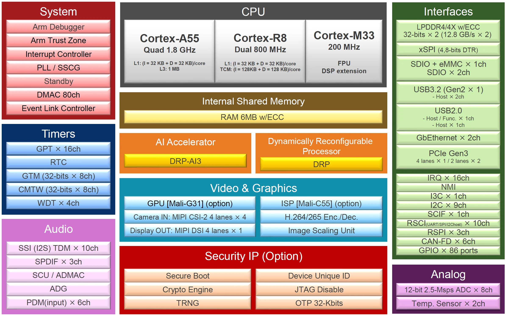

==============
Renesas RZ/V2H
==============

The RZ/V2H is a Renesas AI-accelerated multicore MPU built around a
heterogeneous set of Arm cores: dual Cortex-A55 (application cores) plus
dual Cortex-R8 (real-time cores), alongside a DSP and an AI-MAC (DRP-AI3)
accelerator.

Supported MCUs
==============

The following list includes MCUs from the RZ/V2H series and indicates
whether they are supported in NuttX:

=============  ======= ================
MCU            Support Note
=============  ======= ================
R9A09G057      Yes     CR8_0 core only
=============  ======= ================

Peripheral Support
==================

The following list indicates peripherals supported in NuttX on the CR8_0
core:

==========  =======  ============================================================
Peripheral  Support  Notes
==========  =======  ============================================================
CLOCK       Yes      BSP clock tree init (PLL), internal use only
GIC         Yes      Interrupt controller init (CPU0 + per-CPU)
MPU         Yes      Static PMSAv7 region table (ITCM/DTCM/SRAM/code)
TIMER       Yes      MPCore Private Timer used as the system tick source
SCI         Yes      Interrupt-driven SCI-B asynchronous UART on channels 0-9
GPIO        Yes      Basic operations (config/read/write), no interrupt support
==========  =======  ============================================================

CLOCK
-----

``rzv2h_clockconfig()`` calls into ``bsp_clock_init()`` from the vendored
Renesas FSP BSP to program the PLL and clock tree. It is invoked once
during boot and is not user-configurable through Kconfig.

GIC
---

The Generic Interrupt Controller is brought up by ``up_irqinitialize()``,
using NuttX's common ARM GIC support: CPU0-only initialization followed by
per-CPU initialization.

MPU
---

A static PMSAv7 region table protects the CR8_0 memory map (ITCM, DTCM,
SRAM and the executable code window). Regions are set up once at boot and
are not reconfigurable at runtime.

TIMER
-----

The Arm MPCore Private Timer is used as the system tick source, clocked
from the BSP clock tree and reloaded to match ``CLK_TCK``.

SCI
---

The Serial Communication Interface (SCI) provides multiple serial
communication modes. NuttX currently supports interrupt-driven UART operation
on channels 0 through 9 through the SCI-B lower-half driver.
``CONFIG_RZV2H_UART_SCI`` enables the driver and
``CONFIG_RZV2H_SCI_B_UARTn`` selects each required channel. The standard
``CONFIG_SCIn_*`` options configure the channel and select the console.

The driver supports early console output and registers the selected
console as ``/dev/console`` and ``/dev/ttyS0``. Other enabled channels are
registered in ascending channel order.

Runtime baud-rate changes are supported through the standard termios
``TCGETS`` and ``TCSETS`` operations.

Hardware flow control and DMA are not implemented yet.

GPIO
----

The GPIO driver provides fundamental support for pin configuration, read,
and write operations. GPIO interrupt support is currently unavailable.

Supported Boards
================

.. toctree::
   :glob:
   :maxdepth: 1

   boards/*/*
